 # 30 Days of Code - TCP 2026 🚀

Welcome to my 30-day coding challenge! This repository tracks my daily progress as I build projects and master new web development skills.

 ## 📊 Progress Tracker

| Day | Project Name | Tech Used | Preview | Link |
|:---:|:--- |:--- |:---:|:---:|
| 01 | Personal Portfolio | HTML  |   | [View Folder](./DAY-01/) |
| 02 | Event Landing Page | HTML  |  | [View Folder](./DAY-02/) |
| 03 | Portfolio Styling  | HTML, CSS|  |[View Folder](./DAY-03/)|
| 04 | Product Landing Page  | HTML, CSS|  |[View Folder](./DAY-04/)|
| 05 | Tic Tac Toe Game  | HTML, CSS, JS|  |[View Folder](./DAY-05/)|
| 06 | Time Complexity | C++  | 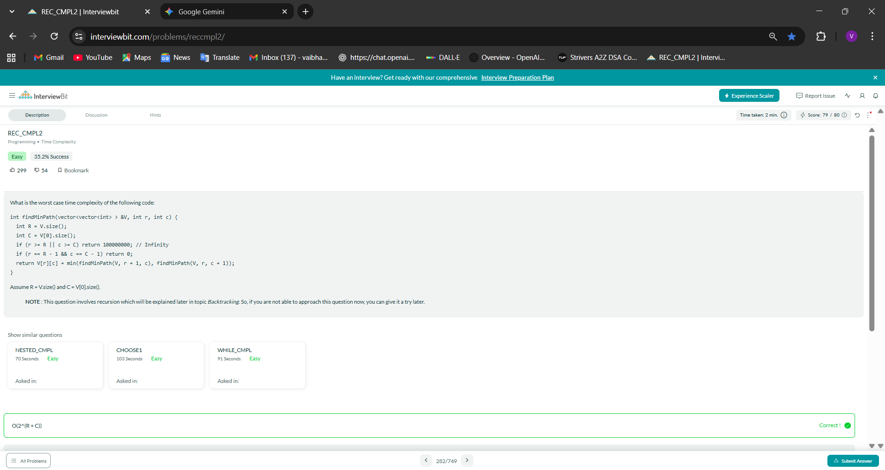 | [View Folder](./DAY-06/) |
| 07 | Sum of Encrypted Integers | C++  | 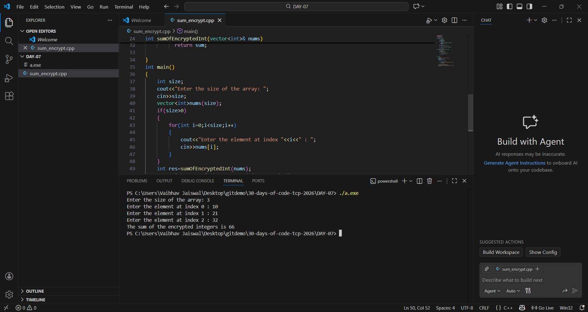 | [View Folder](./DAY-07/) |
| 08 | Longest Consecutive Sequence | C++  | 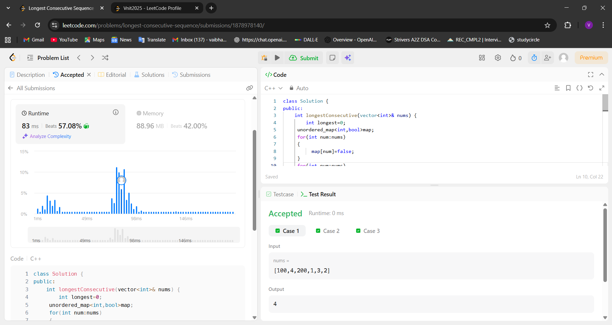 | [View Folder](./DAY-08/) |
| 09 | Largest Odd Number in String | C++  |  | [View Folder](./DAY-09/) |
| 10 | Sorting 0s,1s and 2s | C++  | 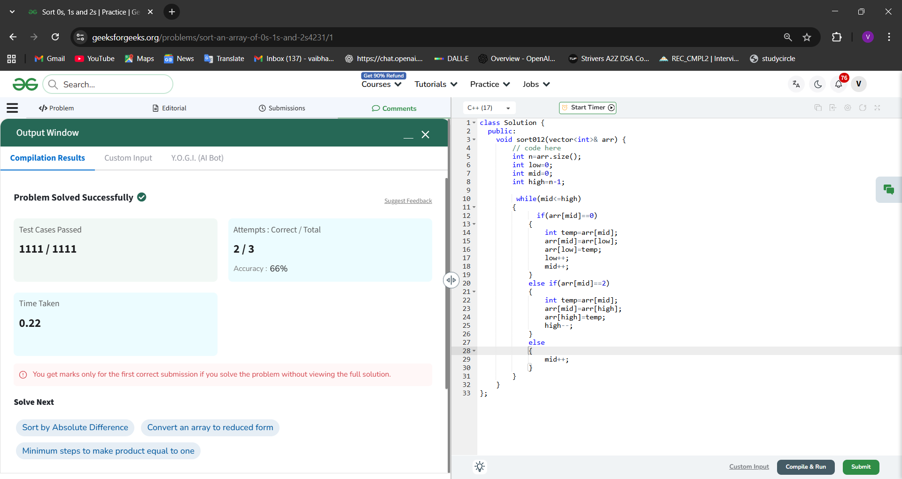 | [View Folder](./DAY-10/) |
| 11 | Merge Sort | C++  | 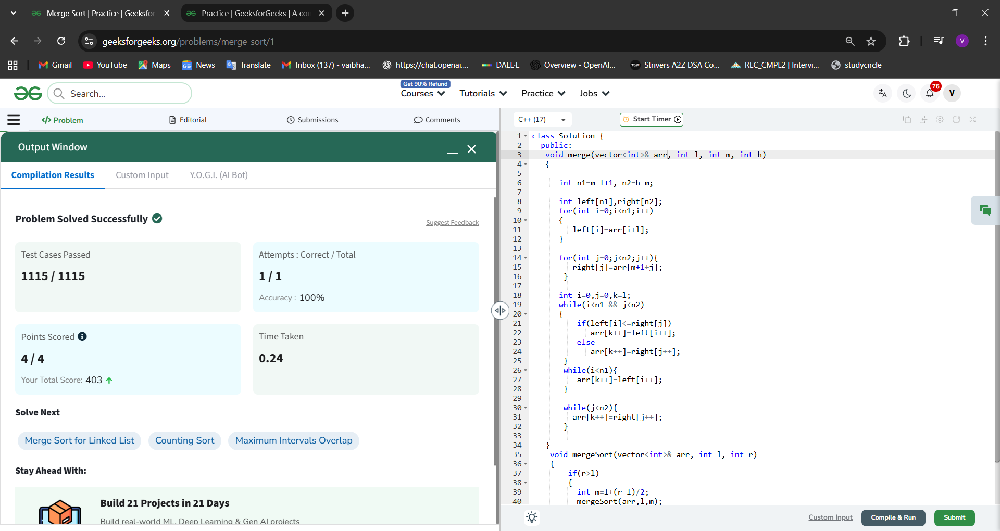 | [View Folder](./DAY-11/) |
| 12 | Find the first and last position of element | C++  | 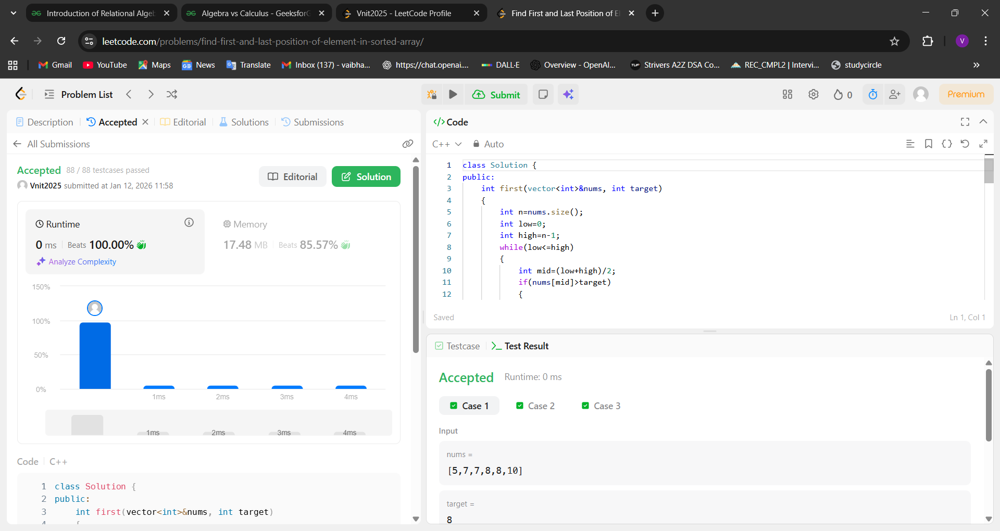 | [View Folder](./DAY-12/) |
| 13 | Koko Eating Bananas | C++  | 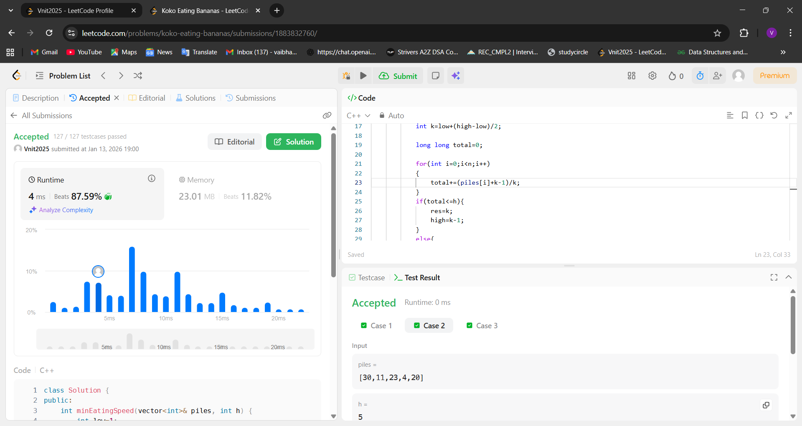 | [View Folder](./DAY-13/) |
| 14 | Count set bits | C++  | 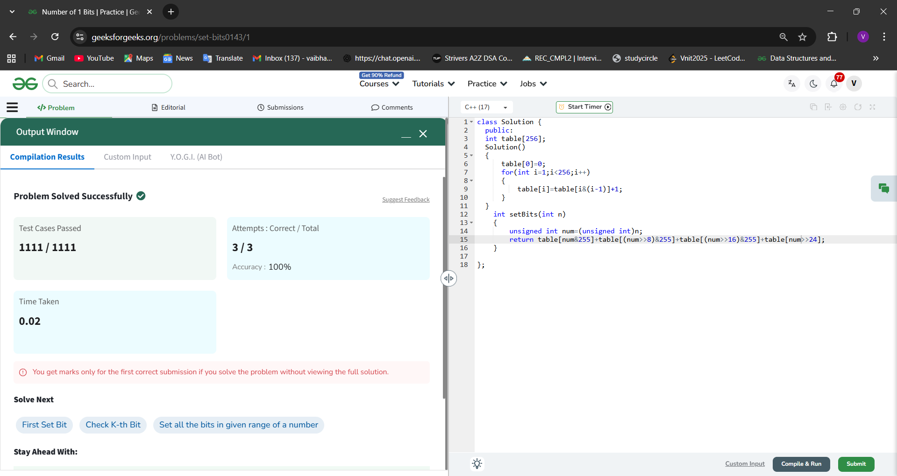 | [View Folder](./DAY-14/) |
| 15 | Ugly number | C++  | 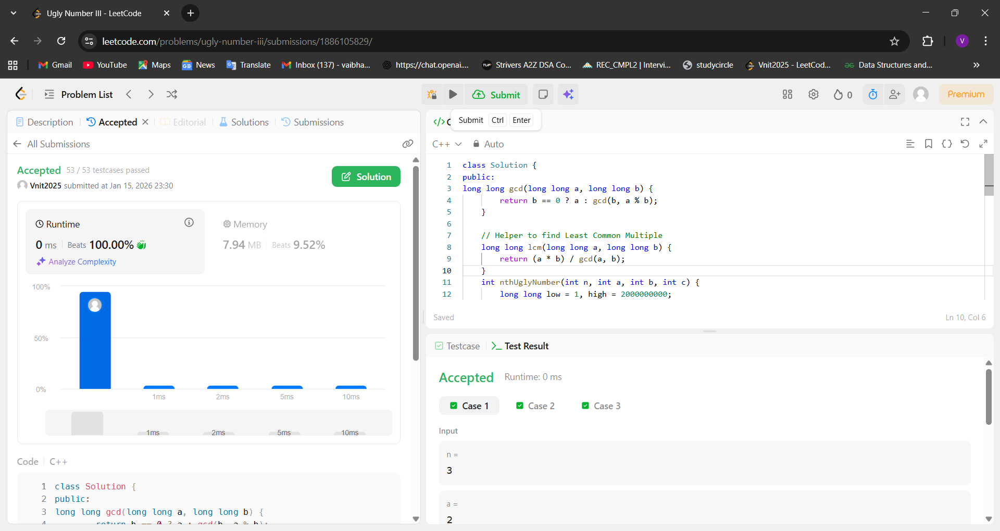 | [View Folder](./DAY-15/) |
| 16 | Candy | C++  | 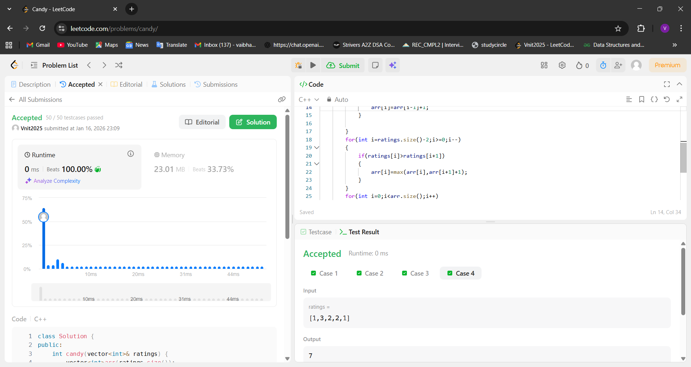 | [View Folder](./DAY-16/) |
| 17 | Good number | C++  | 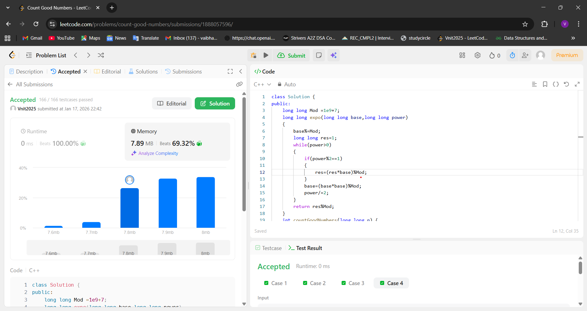 | [View Folder](./DAY-17/) |
| 18 | N-Queens| C++  | 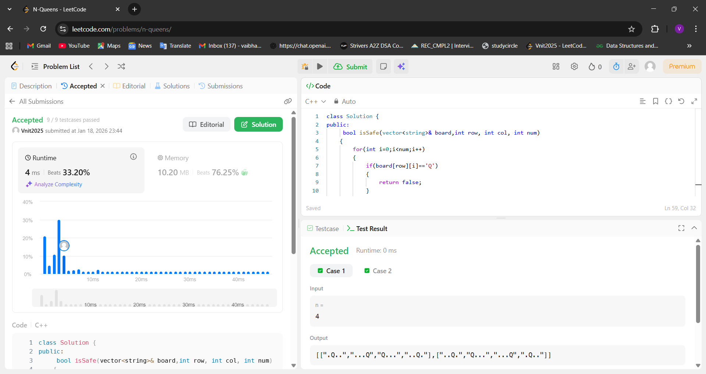 | [View Folder](./DAY-18/) |
| 19 | Add 1 to a linked list number| C++  |  | [View Folder](./DAY-19/) |
| 20 | Odd even linked list| C++  | 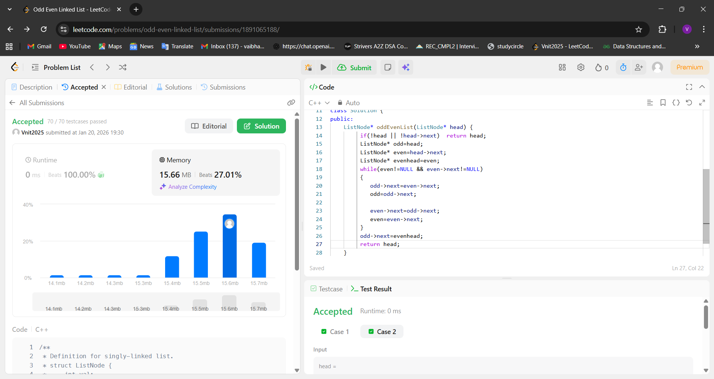 | [View Folder](./DAY-20/) |
| 21 | Next Greater Element| C++  | 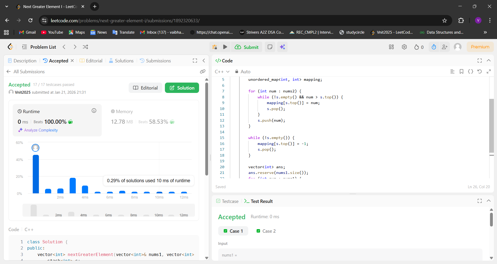 | [View Folder](./DAY-21/) |
| 22 | C++ stl queue| C++  | 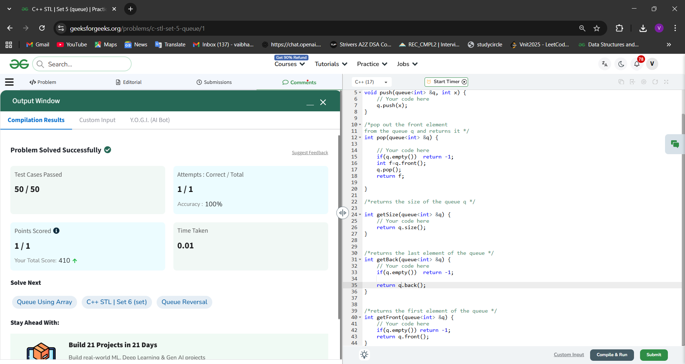 | [View Folder](./DAY-22/) |
| 23 | Sort Character by frequency| C++  | 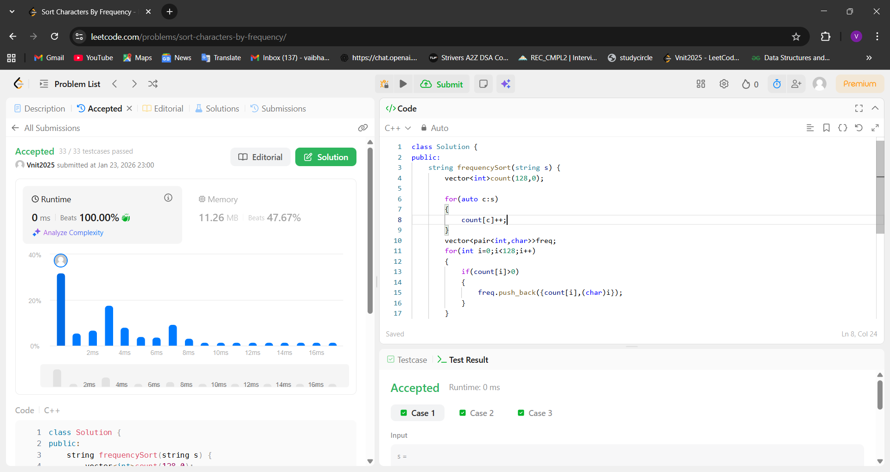 | [View Folder](./DAY-23/) |

