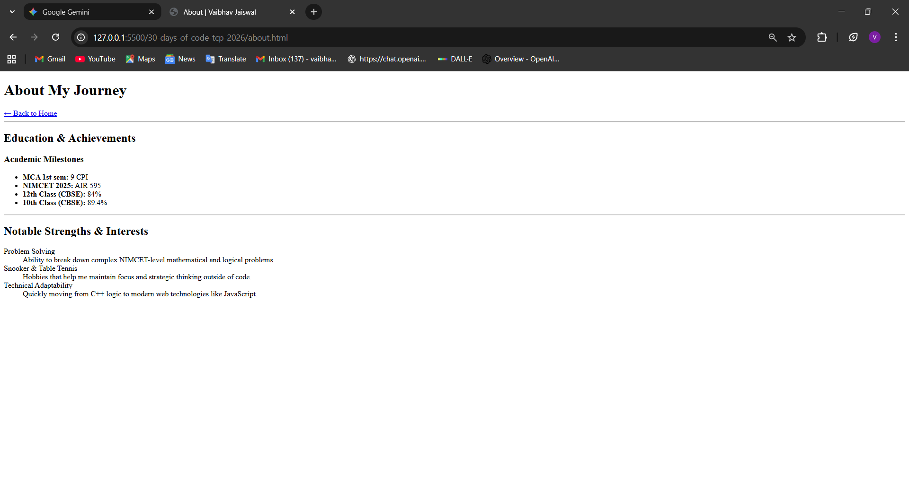
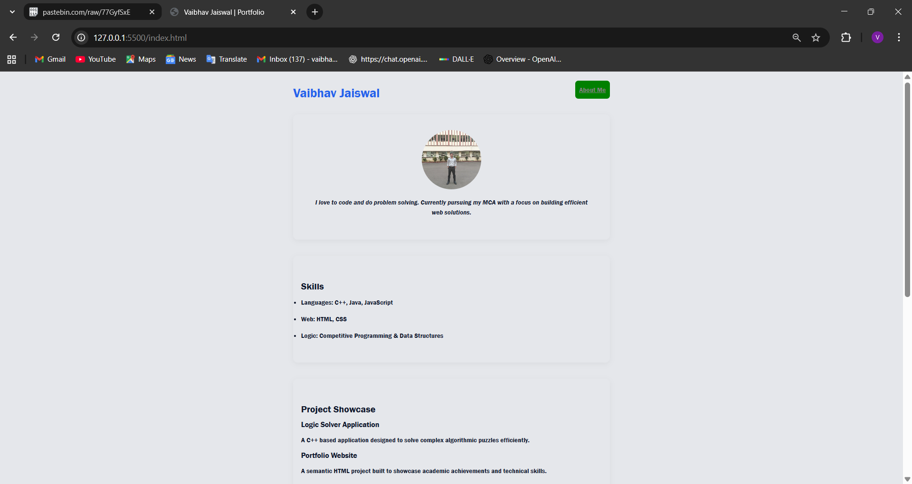
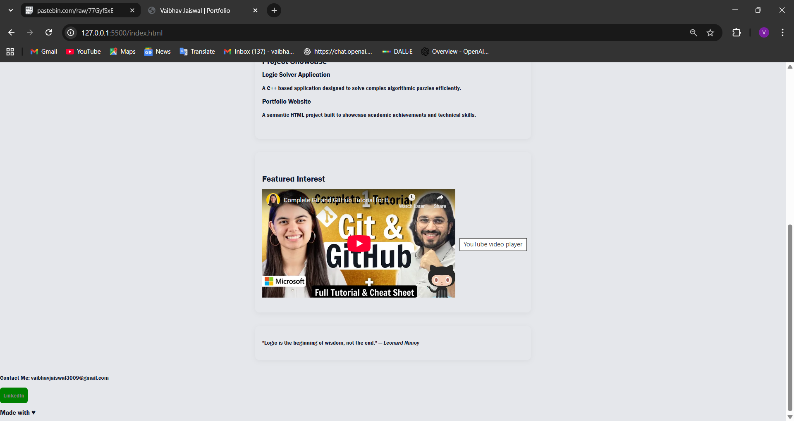
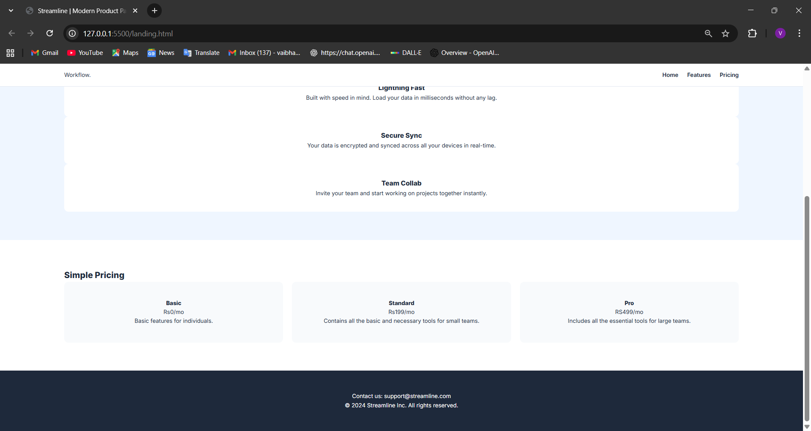
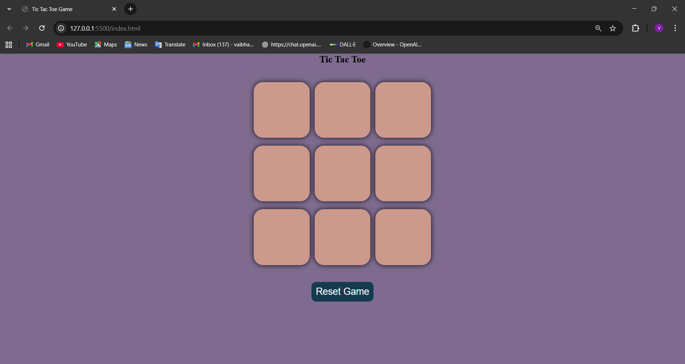
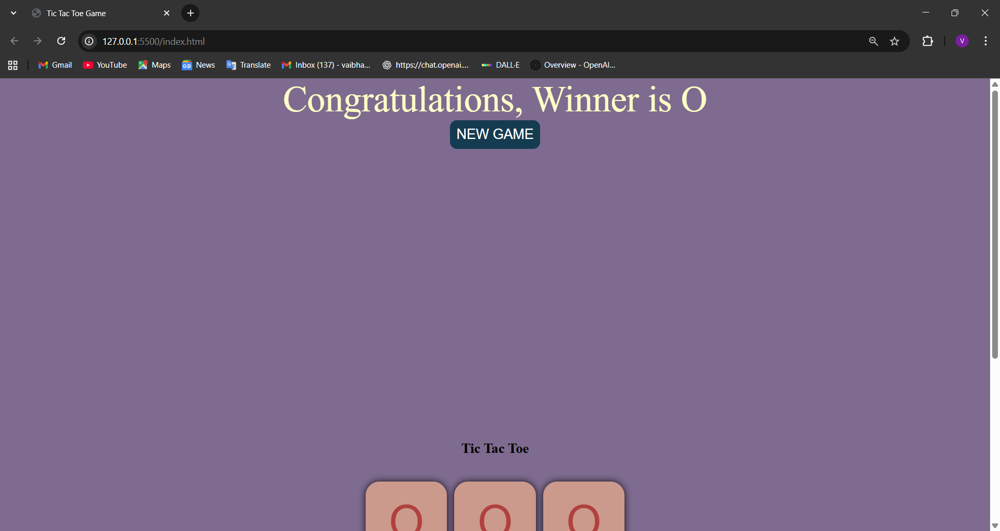

 # 30 Days of Code - TCP 2026 🚀

Welcome to my 30-day coding challenge! This repository tracks my daily progress as I build projects and master new web development skills.

 ## 📊 Progress Tracker

| Day | Project Name | Tech Used | Preview | Link |
|:---:|:--- |:--- |:---:|:---:|
| 01 | Personal Portfolio | HTML  |   | [View Folder](./DAY-01/) |
| 02 | Event Landing Page | HTML  |  | [View Folder](./DAY-02/) |
| 03 | Portfolio Styling  | HTML, CSS|  |[View Folder](./DAY-03/)|
| 04 | Product Landing Page  | HTML, CSS|  |[View Folder](./DAY-04/)|
| 05 | Tic Tac Toe Game  | HTML, CSS, JS|  |[View Folder](./DAY-05/)|
